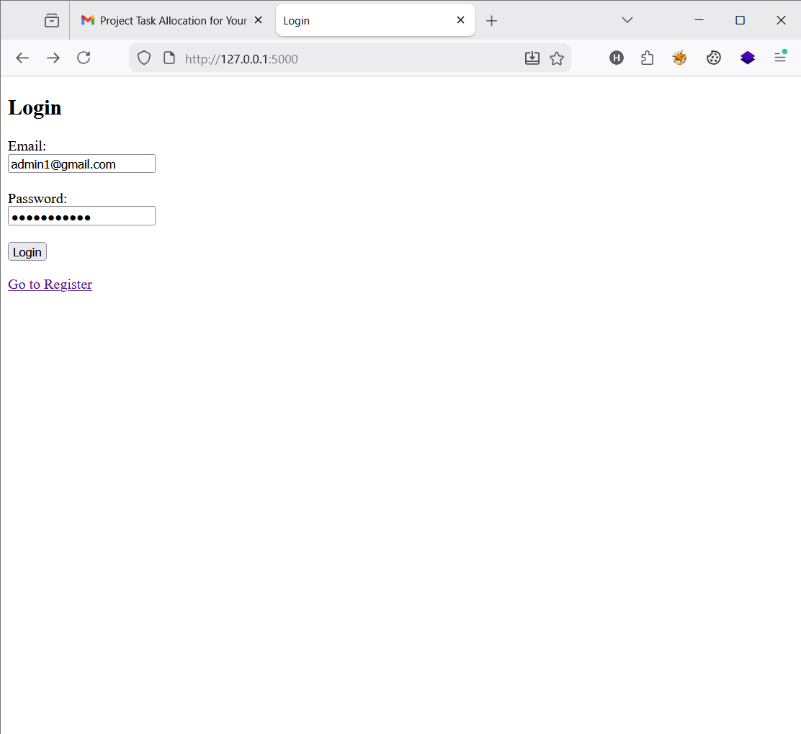
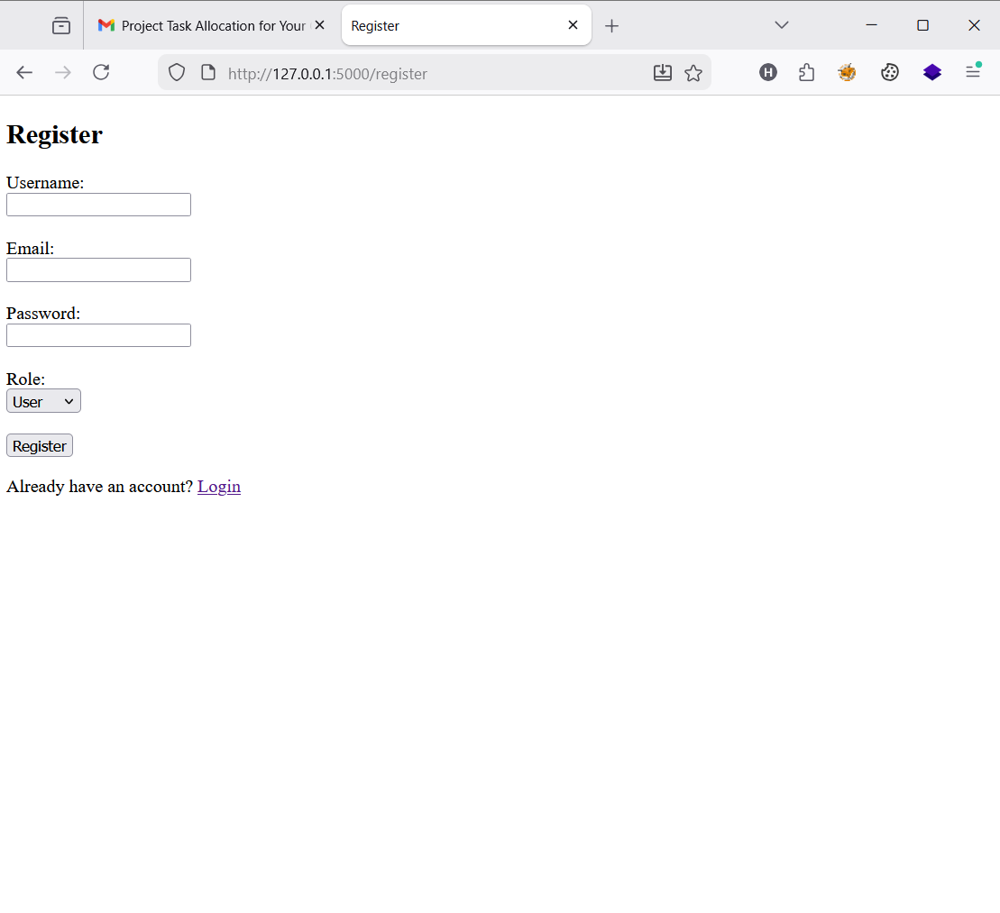
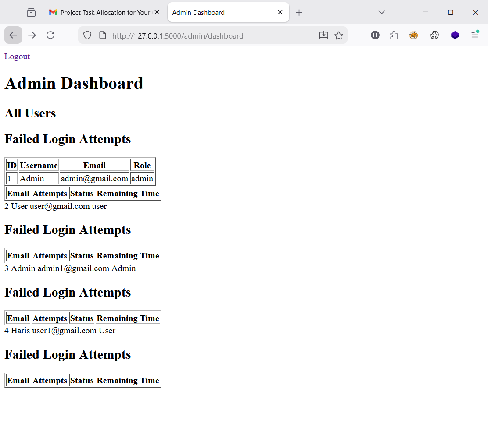
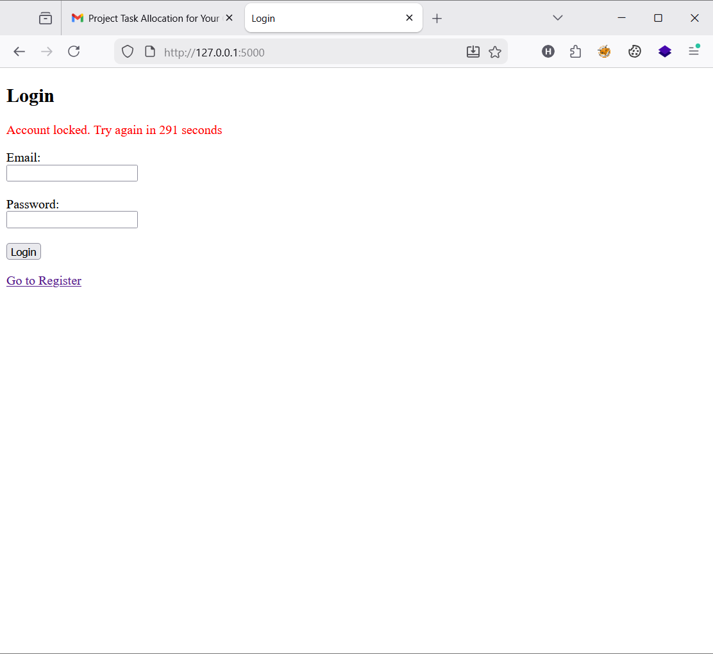
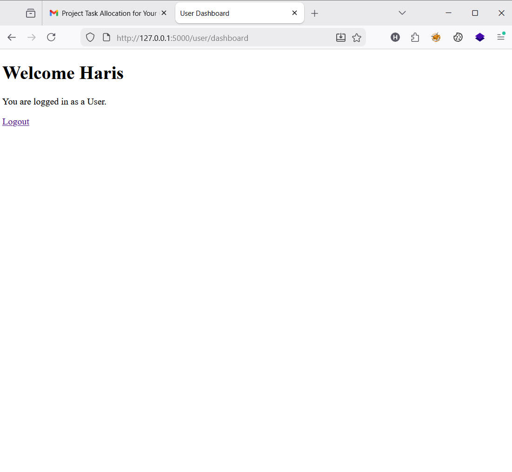

# 🔐 Secure Login System

## 📌 Overview
This project is a secure authentication system built using Flask and SQLite. It includes role-based access control and security mechanisms to protect against common attacks.

---

## 🚀 Features

- User Registration with validation
- Secure password hashing using bcrypt
- Login authentication system
- Session management
- Role-Based Access Control (Admin/User)
- Admin dashboard to manage users
- Failed login attempt tracking
- Time-based account lockout (brute-force protection)

---

## 🛠 Technologies Used

- Python (Flask)
- SQLite
- HTML & CSS
- bcrypt

---

## ▶️ How to Run

1. Clone the repository:
   git clone https://github.com/harishcfis2025/secure-login-systemn.git

2. Navigate to project:
   cd secure-login-systemn

3. Install dependencies:
   pip install flask bcrypt

4. Run the app:
   python run.py

5. Open browser:
   http://127.0.0.1:5000

---

## 🔒 Security Features

- SQL Injection protection (parameterized queries)
- Password hashing (bcrypt)
- Brute-force attack prevention
- Time-based account lockout
- Admin monitoring of failed login attempts

---

## 📸 Screenshots

(Add screenshots here)

---

## ⚠️ Challenges Faced

- Debugging login and session issues
- Implementing role-based access control
- Handling failed login attempts and lockout logic

---

## ✅ Conclusion

This project demonstrates a secure authentication system with real-world security practices including RBAC, session management, and attack prevention mechanisms.